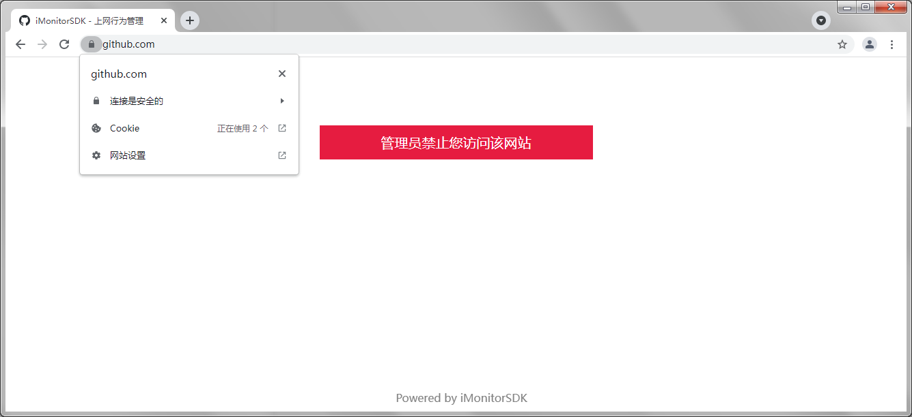

## Introduction

iMonitorSDK is a development kit that provides system behavior monitoring for endpoint and the cloud. Help industry applications such as security, management, and auditing can quickly implement necessary functions without worrying about underlying driver development, maintenance, and compatibility issues, allowing them to focus on business development.

iMonitorSDK development team comes from a leading domestic Internet company with more than ten years of security development experience. The communication framework based on the message protocol makes the driver development more stable and faster. Kernel monitoring is implemented in a stable and standard way, and supports Windows (XP-Win11), Linux, and MacOS at the same time.

With iMonitorSDK, common terminal security functions such as self-protection, process interception, ransomware defense, active defense, and Internet behavior management can be realized at a very low cost.

### ✨ Core Functions

- Process, File, Registry Protection

- Process startup, module loading interception, module injection

- File interception and redirection

- Network firewall, traffic proxy, protocol analysis
- Rule engine, script support

### 📦 Applicable to the following products

- Endpoint Security Management System
- EDR
- HIPS
- Cloud Security
- Zero trust
- Internet Access Control

## 🔨 Quick start

Example 1: Process start interception

```c++
class MonitorCallback : public IMonitorCallback
{
public:
	void OnCallback(IMonitorMessage* Message) override
	{
		if (Message->GetType() != emMSGProcessCreate)
			return;

		cxMSGProcessCreate* msg = (cxMSGProcessCreate*)Message;

		//
		// Block the process of the process name cmd.exe from starting
		//

		if (msg->IsMatchPath(L"*\\cmd.exe"))
			msg->SetBlock();
	}
};

int main()
{
	MonitorManager manager;
	MonitorCallback callback;

	HRESULT hr = manager.Start(&callback);

	if (hr != S_OK) {
		printf("start failed = %08X\n", hr);
		return 0;
	}

	cxMSGUserSetMSGConfig config;
	config.Config[emMSGProcessCreate] = emMSGConfigSend;
	manager.InControl(config);

	WaitForExit("Block the process of the process name cmd.exe from starting");

	return 0;
}
```

Example 2: Self-protection

```c++
class MonitorCallback : public IMonitorCallback
{
public:
	void OnCallback(IMonitorMessage* Message) override
	{}
};

int main()
{
	MonitorManager manager;
	MonitorCallback callback;

	HRESULT hr = manager.Start(&callback);

	if (hr != S_OK) {
		printf("start failed = %08X\n", hr);
		return 0;
	}

	manager.InControl(cxMSGUserEnableProtect());

	{
		cxMSGUserAddProtectRule rule;
		rule.ProtectType = emProtectTypeProcessPath | emProtectTypeFilePath;
		wcsncpy(rule.Path, L"*\\notepad.exe", MONITOR_MAX_BUFFER);
		manager.InControl(rule);
	}

	{
		cxMSGUserAddProtectRule rule;
		rule.ProtectType = emProtectTypeFilePath;
		wcsncpy(rule.Path, L"*\\protect>", MONITOR_MAX_BUFFER);
		manager.InControl(rule);
	}

	{
		cxMSGUserAddProtectRule rule;
		rule.ProtectType = emProtectTypeRegPath;
		wcsncpy(rule.Path, L"*\\iMonitor>", MONITOR_MAX_BUFFER);
		manager.InControl(rule);
	}

	{
		cxMSGUserAddProtectRule rule;
		rule.ProtectType = emProtectTypeTrustProcess;
		wcsncpy(rule.Path, L"*taskkill*", MONITOR_MAX_BUFFER);
		manager.InControl(rule);
	}

	WaitForExit("SelfProtect");

	manager.InControl(cxMSGUserRemoveAllProtectRule());
	manager.InControl(cxMSGUserDisableProtect());

	return 0;
}
```

Example 3: sysmon

```c++
class MonitorCallback : public IMonitorCallback
{
public:
	void OnCallback(IMonitorMessage* msg) override
	{
		printf("%S ==> %S\n", msg->GetTypeName(), msg->GetFormatedString(emMSGFieldCurrentProcessPath));

		for (ULONG i = emMSGFieldCurrentProcessCommandline; i < msg->GetFieldCount(); i++) {
			printf("\t%30S : %-30S\n", msg->GetFieldName(i), msg->GetFormatedString(i));
		}
	}
};

int main()
{
	MonitorManager manager;
	MonitorCallback callback;

	HRESULT hr = manager.Start(&callback);

	if (hr != S_OK) {
		printf("start failed = %08X\n", hr);
		return 0;
	}

	cxMSGUserSetMSGConfig config;
	for (int i = 0; i < emMSGMax; i++) {
		config.Config[i] = emMSGConfigPost;
	}
	manager.InControl(config);

	WaitForExit("");

	return 0;
}
```


Example 4: Internet Access Control (based on network redirection, support https, refer to http_access_control example for details)



More examples can refer to the sample directory.

[For detailed instructions, please refer to the SDK documentation. ](./doc/README.md)

## License 

> Disclaimer:
>
> iMonitorSDK (hereinafter referred to as the SDK) is only licensed to be used by regular enterprise manufacturers. It is forbidden to be used in any illegal scenes such as endangering the safety of enterprises and individuals.
>
> The economic losses and legal issues caused by illegal authorization and illegal use have nothing to do with the SDK providing team.
>
> Before you use this SDK, it is deemed that you have known and complied with this disclaimer.

Functional differences of different licenses:

| Function description | Free License | Enterprise License | Enterprise Custom License |
| -------------------- | ------------ | ------------------ | ------------------------- |
| Process Monitoring | ✔ | ✔ | ✔ |
| File Monitoring | ✔ | ✔ | ✔ |
| Registry Monitoring | ✔ | ✔ | ✔ |
| Network Monitoring | ✔ | ✔ | ✔ |
| Self-protection | ✔ | ✔ | ✔ |
| Network Protocol Proxy | ✔ | ✔ | ✔ |
| Kernel object customization | | ✔ | ✔ |
| Configuration | | ✔ | ✔ |
| Rule Engine | | ✔ | ✔ |
| Javascript script support | | | ✔ |
| Linux support | | | ✔ |
| MacOS support | | | ✔ |
| Source code | | | ✔ |
| Service Support | Mail, GitHub | Mail, GitHub, WeChat, Remote Desktop | ✔ |

[ contact via email (iMonitor@qq.com) for a licence ](mailto://iMonitor@qq.com)

## Products using this SDK

- [iMonitor - Endpoint Behavior Analysis System](https://github.com/wecooperate/iMonitor)
- [iDefender - Endpoint Active Defense System](https://github.com/wecooperate/iDefender)

## Version(LTS:1.0.4.0)

#### 1.0.4.0

1. Application layer returns to drive parameters to add more setting support

 Support the return path, automatically insert APC to inject DLL into the current process

 Support setting to end the current process and thread

2. Add private signature support for PE files

 Add configuration control to only allow processes with private signatures to open the driver to ensure that the driver is not used

 The private signature of the PE file can be set to self-protection mark, and it will automatically be self-protected when it is started.

3. Add support for self-protection level (low-level self-protection processes cannot open high-level protection processes, and the PE file self-protection mark defaults to low level)

4. Optimize the GUID generation rules of WFP, which can be compatible with installing multiple drivers at the same time

5. Optimize the timeout settings for synchronous and asynchronous events. Different timeouts can be set for synchronous and asynchronous events

6. (After feedback, it is necessary to fully support XP) The method of restoring SSDT Hook under XP is used to make up for the functions that the lower version of the standard Callback cannot achieve

7. Add the following configuration to the driver configuration: enable_sign_protect, enable_sign_open_protect

**Add LTS version support**:

 At present, there are many customers using SDK. In order to ensure stability, version 1.0.4.X is used as the LTS version, which only fixes BUG and no longer adds any functions.

#### 1.0.3.0

drive:

Add quick filter support for frequent operations such as opening processes and files
Add a fuse mechanism that causes the system to get stuck due to application processing event timeout
Add the timeout configuration of the session, different applications can set different timeouts

Application layer:

Optimization rule filtering: add matching cache, add extended child nodes

#### 1.0.2.0

Add proxy support

Add a demonstration of Internet behavior management function

#### 1.0.1.0

Initial version

## About Us

Excellent people, do professional things.

wecooperate is a company dedicated to providing basic services and integrated management platform for enterprise management, striving to become the entrance of enterprise management and promoting the standardization and digitization of enterprise management.

If you have business agency, business cooperation, function customization and other needs, [Contact Us](mailto://iMonitor@qq.com)