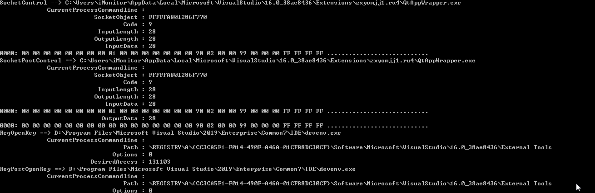

## 简介

iMonitorSDK是一款为终端、云端提供系统行为监控的开发套件。

旨在帮助安全、管理、审计等行业应用可以快速实现必要功能，而不用关心底层驱动的开发、维护和兼容性问题，让其可以专注于业务开发。

iMonitorSDK使用基于消息协议的通信框架，让驱动开发更加稳定、快速。内核监控使用了稳定、标准的方式实现，同时支持Windows（XP-Win11）。Linux、MacOS也正在规划支持中。

利用iMonitorSDK可以极低成本地实现自保护、进程拦截、勒索病毒防御、主动防御、上网行为管理等等终端安全常见的功能。

### [接入文档](https://imonitorsdk.com/)

接口文档，版本说明详细见接入文档

### ✨ 具备如下核心功能

- 进程、文件、注册表、网络各种事件监听，支持拦截禁止
- 进程、文件、注册表保护
- 进程启动、模块加载拦截，模块注入
- 文件拦截、重定向
- 网络防火墙、流量代理、协议分析
- 规则引擎、动态脚本

### 📦 适用于如下的产品

- 主动防御

- 终端管控

- 入侵检测
- 主机安全
- 零信任

- 上网行为管理

## 🔨 快速入门

示例一：进程启动拦截

```c++
class MonitorCallback : public IMonitorCallback
{
public:
	void OnCallback(IMonitorMessage* Message) override
	{
		if (Message->GetType() != emMSGProcessCreate)
			return;

		cxMSGProcessCreate* msg = (cxMSGProcessCreate*)Message;

		//
		// 禁止进程名 cmd.exe 的进程启动
		//

		if (msg->IsMatchPath(L"*\\cmd.exe"))
			msg->SetBlock();
	}
};

int main()
{
	MonitorManager manager;
	MonitorCallback callback;

	HRESULT hr = manager.Start(&callback);

	if (hr != S_OK) {
		printf("start failed = %08X\n", hr);
		return 0;
	}

	cxMSGUserSetMSGConfig config;
	config.Config[emMSGProcessCreate] = emMSGConfigSend;
	manager.InControl(config);

	WaitForExit("禁止进程名 cmd.exe 的进程启动");

	return 0;
}
```

示例二：自保护规则设置

```c++
class MonitorCallback : public IMonitorCallback
{
public:
	void OnCallback(IMonitorMessage* Message) override
	{}
};

int main()
{
	MonitorManager manager;
	MonitorCallback callback;

	HRESULT hr = manager.Start(&callback);

	if (hr != S_OK) {
		printf("start failed = %08X\n", hr);
		return 0;
	}

	manager.InControl(cxMSGUserEnableProtect());

	//
	// Path路径支持通配符
	//	* 表示任意n个字符
	//	? 表示任意一个字符
	//	> 用于字符串结尾，表示字符串结束或者是\\结尾，用于目录判断（比如protect> 匹配 protect 和 protect\\*）
	//
	{
		//
		// 添加进程、文件保护： 保护进程名是notepad.exe的进程不被结束、文件不被修改、删除
		//
		cxMSGUserAddProtectRule rule;
		rule.ProtectType = emProtectTypeProcessPath | emProtectTypeFilePath;
		wcsncpy(rule.Path, L"*\\notepad.exe", MONITOR_MAX_BUFFER);
		manager.InControl(rule);
	}

	{
		//
		// 添加文件夹保护： 保护protect目录下面的文件不被外部修改、目录不被重命名、删除
		//
		cxMSGUserAddProtectRule rule;
		rule.ProtectType = emProtectTypeFilePath;
		wcsncpy(rule.Path, L"*\\protect>", MONITOR_MAX_BUFFER);
		manager.InControl(rule);
	}

	{
		//
		// 添加注册表保护： 保护iMonitor键不被删除、修改，包括键值
		//
		cxMSGUserAddProtectRule rule;
		rule.ProtectType = emProtectTypeRegPath;
		wcsncpy(rule.Path, L"*\\iMonitor>", MONITOR_MAX_BUFFER);
		manager.InControl(rule);
	}

	{
		//
		// 添加信任进程：可以操作被保护的进程、文件、注册表，但是进程本身不受保护
		//
		cxMSGUserAddProtectRule rule;
		rule.ProtectType = emProtectTypeTrustProcess;
		wcsncpy(rule.Path, L"*taskkill*", MONITOR_MAX_BUFFER);
		manager.InControl(rule);
	}

	WaitForExit("自保护开启中");

	manager.InControl(cxMSGUserRemoveAllProtectRule());
	manager.InControl(cxMSGUserDisableProtect());

	return 0;
}
```

示例三：sysmon

```c++
class MonitorCallback : public IMonitorCallback
{
public:
	void OnCallback(IMonitorMessage* msg) override
	{
		printf("%S ==> %S\n", msg->GetTypeName(), msg->GetFormatedString(emMSGFieldCurrentProcessPath));

		for (ULONG i = emMSGFieldCurrentProcessCommandline; i < msg->GetFieldCount(); i++) {
			printf("\t%30S : %-30S\n", msg->GetFieldName(i), msg->GetFormatedString(i));
		}
	}
};

int main()
{
	MonitorManager manager;
	MonitorCallback callback;

	HRESULT hr = manager.Start(&callback);

	if (hr != S_OK) {
		printf("start failed = %08X\n", hr);
		return 0;
	}

	cxMSGUserSetMSGConfig config;
	for (int i = 0; i < emMSGMax; i++) {
		config.Config[i] = emMSGConfigPost;
	}
	manager.InControl(config);

	WaitForExit("");

	return 0;
}
```



示例四：上网行为管理（基于网络重定向的方式实现，支持https，详细参考http_access_control例子）


示例五：任意时刻对进程注入动态库

```c++
class MonitorCallback : public IMonitorCallback
{
public:
	void OnCallback(IMonitorMessage* Message) override
	{
		if (Message->GetType() != emMSGImageLoad)
			return;

		cxMSGImageLoad* msg = (cxMSGImageLoad*)Message;

		if (!msg->IsMatchCurrentProcessName(L"notepad.exe"))
			return;

		if (msg->IsMatchPath(L"*\\kernel32.dll")) {
			msg->SetInjectDll(L"D:\\test.dll");
		}
	}
};

int main()
{
	MonitorManager manager;
	MonitorCallback callback;

	HRESULT hr = manager.Start(&callback);

	CheckSignError(hr);

	if (hr != S_OK) {
		printf("start failed = %08X\n", hr);
		return 1;
	}

	manager.InControl(cxMSGUserSetGlobalConfig());

	cxMSGUserSetMSGConfig config;
	config.Config[emMSGImageLoad] = emMSGConfigSend;
	manager.InControl(config);

	WaitForExit("模块注入：在notepad.exe启动加载kernel32.dll过程中，让其强制加载D:\\test.dll");

	return 0;
}
```

更多的示例可以参考sample目录。

## 使用本SDK的产品

- [iMonitor 冰镜 - 终端行为分析系统](https://github.com/wecooperate/iMonitor)
- [iDefender 冰盾 - 终端主动防御系统](https://github.com/wecooperate/iDefender)

## 获取授权

[授权请通过邮箱（admin@iMonitorSDK.com）联系。](mailto://admin@iMonitorSDK.com)

## 关于我们

优秀的人，做专业的事。

创信长荣科技的团队来自国内头部互联网公司，具备十多年安全底层开发经验、架构设计能力，对企业安全业务有着深刻的理解。 是一家致力于为企业管理提供基础服务、一体化管理平台，力争成为企业管理入口，促进企业管理标准化、数字化的企业。
